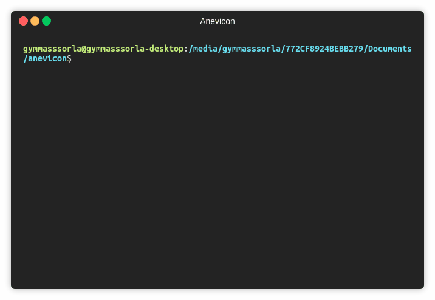

<div align="center">
  <h1>anevicon</h1>
  
  <a href="https://gitter.im/Gymmasssorla/anevicon">
    
  </a>
  <a href="https://travis-ci.com/Gymmasssorla/anevicon">
    
  </a>
  <a href="https://github.com/Gymmasssorla/anevicon/blob/master/LICENSE">
    
  </a>
  <a href="https://crates.io/crates/anevicon">
    
  </a>
  
  <br>
  
  Anevicon is a high-performance traffic generator, designed to be as convenient and reliable as it is possible. It sends
numerous UDP-packets to a victim, thereby simulating an activity that can be produced by your end users or a
group of hackers.
</div>

## Disclaimer
> Anevivon is still under heavy development process and it is quite unstable now, not all options are implemented, and not all things are tested as it should. Feel free to contribute, add more features, debate with others, and suggest your genius ideas!

## Installation
```bash
$ git clone https://github.com/Gymmasssorla/anevicon.git
$ cd anevicon
$ cargo run --release -- --help
```

## Usage
```
anevicon 0.1.0
Temirkhan Myrzamadi <gymmasssorla@gmail.com>
An UDP-based server stress-testing tool, written in Rust.

USAGE:
    anevicon [FLAGS] [OPTIONS] --receiver <ADDRESS>

FLAGS:
        --debug      Enable the debugging mode
    -h, --help       Prints help information
    -V, --version    Prints version information

OPTIONS:
        --display-periodicity <PACKETS>
            A count of packets per displaying attack summaries. It is not
            recommended to set this option to a small value (say, 6) for the
            performance reasons. [default: 300]
    -d, --duration <TIME-SPAN>
            A program working time. The default value is too big, that is, an
            attack will be performed until you explicitly stop the process.
            [default: 64years 64hours 64secs]
    -l, --length <BYTES>
            A size of each UDP-packet in the range of [1; 65000], specified in
            bytes. Note that your system or a victim server might not be able to
            handle the default value. [default: 65000]
    -p, --packets <COUNT>
            A count of packets for sending. The default value equals to the
            largest number available for the inner data type. [default:
            18446744073709551615]
    -r, --receiver <ADDRESS>
            A receiver of generated traffic, specified as an IP-address and a
            port number, separated by the colon character.
        --send-periodicity <TIME-SPAN>
            A periodicity of sending packets. The default value equals to zero
            seconds, that is, all packets will be sent momentarily. [default:
            0secs]
    -s, --sender <ADDRESS>
            A sender of generated traffic, specified as an IP-address and a port
            number, separated by the colon character. [default: 0.0.0.0:0]
    -w, --wait <TIME-SPAN>
            A waiting time before an attack execution. It is mainly used to
            prevent a launch of an erroneous (unwanted) attack. [default: 5secs]

For more information see <https://github.com/Gymmasssorla/anevicon>.
```


## Cautions
 - The goal of Anevicon is to produce the maximum possible (for the attacking system) load on the specified victim address. Thereby, this **DOES NOT MEAN** that Anevicon will break **ABSOLUTELY ANY SERVER** while running on your computer.
 
 - Anevicon was developed as a means of testing the stress resistance of servers, and not for hacking, that is, the author of the project **IS NOT RESPONSIBLE** for any damage caused by your use of my program. See [the license notice](https://github.com/Gymmasssorla/anevicon/blob/master/LICENSE#L600).
 
 - Despite the fact that Anevicon is heavily tested both automatically and manually, does not mean that the author is responsible for any bug in his work. The program comes with **ABSOLUTELY NO WARRANTY**, see [the license disclaimer](https://github.com/Gymmasssorla/anevicon/blob/master/LICENSE#L589).
